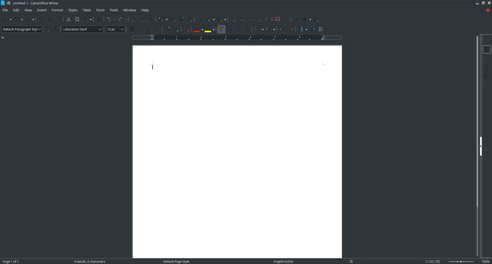

# LibreOffice

*First published: 2020-12-07 | Last updated: 2021-05-09*

Note: this page is incomplete.

## Preamble

To use Microsoft's Office suite, you have to either pay for it, or you have to use their online version. For what should be such a simple thing, why do you need to pay Microsoft 70 dollars a year to use it?! Why?

Some would counter this with a solution like Google Docs. It is free, solving that issue. I personally use Docs for school and for easily sharing things. However, Google still has all of your personal data, and all of your documents. You're hosting the documents on their servers (where you have limited space anyways, unless you pay), and you don't have complete control over what Google does with your data.

Enter: **FOSS OFFICE PRODUCTS!**

## Comparison of Features Offered

| LibreOffice | MS Office  | GSuite   |
|-------------|------------|----------|
| Writer      | Word       | Docs     |
| Calc        | Excel      | Sheets   |
| Impress     | PowerPoint | Slides   |
| Draw        | N/A        | Drawings |
| Math        | N/A        | N/A      |
| Base        | N/A        | N/A      |
| N/A         | Outlook    | Gmail    |
| N/A         | OneDrive   | Drive    |

## Information

LibreOffice has a smooth, simple look that follows your device's theme.
As any good office product should, it runs well even on bad hardware. Its system requirements mean that even an old Windows XP system (why would you be using XP?) could run it well.

LibreOffice Writer, Calc, and Impress are meant to look like its MS Office counterparts, meaning if you're used to using Word, Excel, and PowerPoint, the learning curve should be minimal, as a lot of the functions, features, etc. are the same. It's a bit more complex than GSuite products, being that it's a fully fledged application instead of a browser application, but everything's still... there.

In true Libre fashion, everything is open source, and everything is free. Even things like the fonts, the default font is Liberation Sans, basically the Linux equivalent to Arial. Microsoft even charges for Arial, the 2nd most used font in the world?? Crazy. If you really need to use Arial, Times New Roman, etc., you can get them by installing the AUR [ttf-ms-fonts](https://aur.archlinux.org/packages/ttf-ms-fonts/) package on Arch(-based) systems, or you can just use it normally if you're on Windows.
